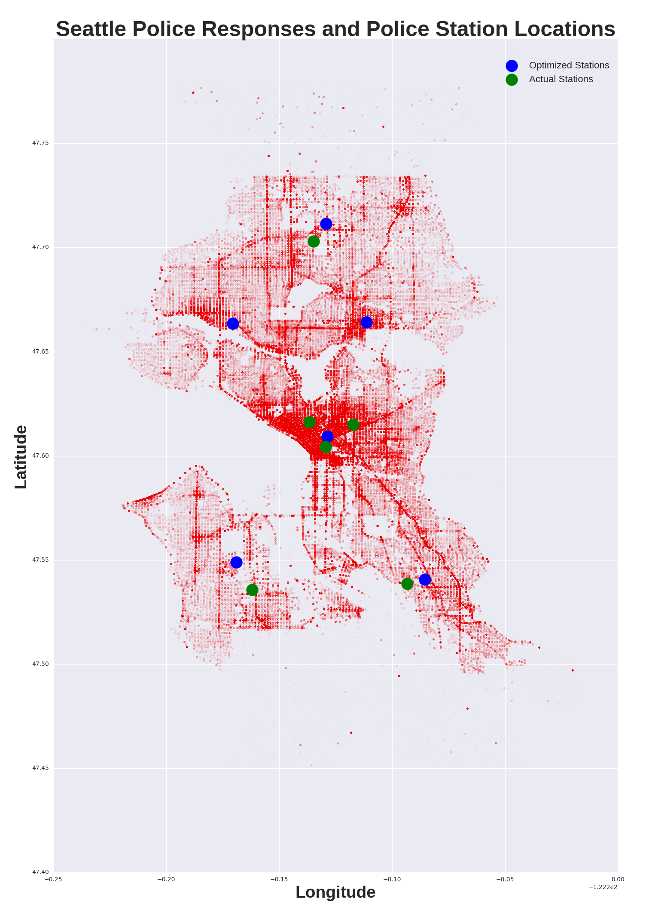

# Using unsupervised learning to calculate optimal Seattle PD station locations

#### Figure: Seattle police responses shown in red. K-Means optimized SPD station locations shown in blue and actual station locations shown in green.
I decided to use some simple machine learning to calculate the optimal SPD station locations with data for around 1.5 million police responses. This was a very fun project because I had to ‘manually’ implement the K-means algorithm so I could use a custom distance measurement (see src folder). K-means is a method used to allow computers to mathematically recognize patterns and group data without being given explicit instructions.

Using the SPD stations example, the algorithm to randomly places six stations around the map. Next, each police response is mapped to the nearest station so six groups of police responses are formed. The stations are then relocated to the center of their group and the responses are remapped to the nearest new station location. Repeat this 1000 times or so, and the algorithm can determine the optimal locations of SPD stations around the city. The calculations took a couple of hours because calculating distance using latitude and longitude is surprisingly non-trivial with curvature of the Earth and the fact that longitudinal distance varies with latitude.

I noticed a couple really interesting things here.
- The algorithm has no knowledge of the locations of the real SPD stations, yet 4 of the 6 locations calculated are quite close to the real locations. This is very surprising because I’d imagine the real locations were selected decades ago without much scientific evaluation.
- According to the model, the North end should have 3 stations instead of 1. Is this lack of stations due to the relatively late incorporation of the North end?

Fine print disclaimer – This is a quick and dirty after school project run on a laptop so there are some real limitations to the model. The model does not understand water, traffic, and street distances because I did not have the time or computing power to implement these things. These results should be taken with a grain of salt.
 
 

